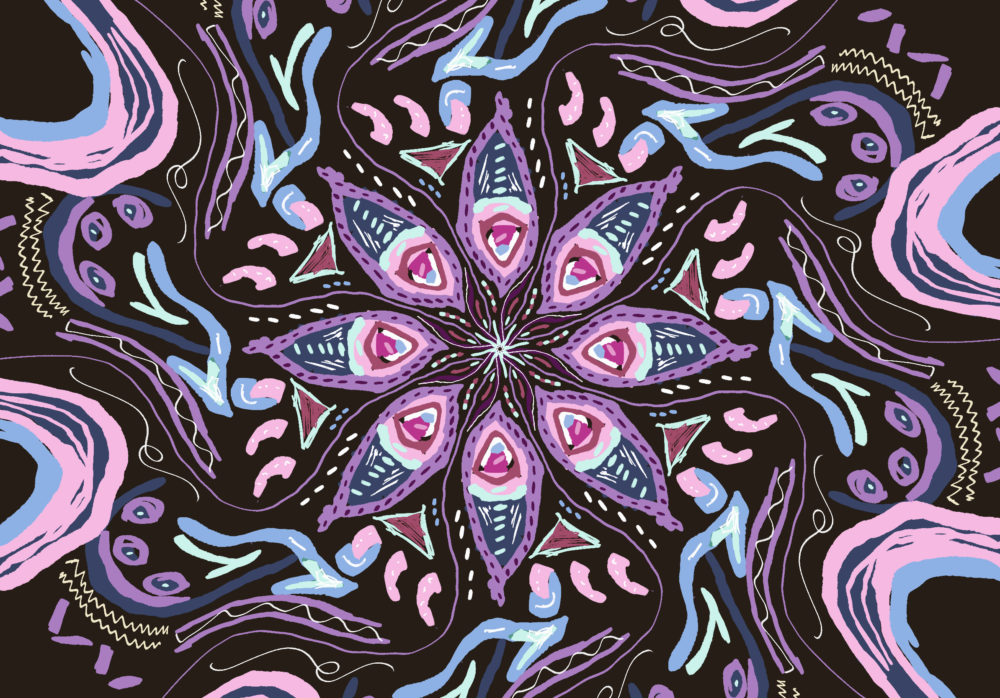

# Week 06

[← Back to Home](../index.md)

## Data Audit: Self-Portrait Through External Perspectives 

### What the data source is and where it comes from
*For this project, I plan to create my own dataset by collecting responses from friends and family members. The idea is to build a self-portrait based on how other people perceive me rather than how I see myself. Participants will be asked a series of questions about my personality, interests, strengths, habits, and overall character. This will generate a dataset made up of personal observations and opinions from people who know me in different ways.*

### What the data contains and how it is structured
*The dataset will mainly consist of qualitative data collected through surveys or questionnaires. Responses may include descriptive words, short written answers, ratings, or personal reflections. Each participant's responses will be recorded separately, allowing me to compare similarities and differences between how people describe me.*
*Once collected, the data could be organised into categories such as personality traits, values, emotions, interests, relationships, and recurring themes. This structure will help identify patterns that can later inform the visualisation and design of the self-portrait.*

### Potential limitations, biases, and gaps
*As the data has not yet been collected, there are several limitations that I anticipate. The responses will be subjective and influenced by each participant's personal relationship with me. Family members, friends, and classmates may all see different sides of my personality, creating varied and potentially conflicting results.*
*There may also be positive bias, as participants might focus on qualities they like or avoid sharing negative opinions. The dataset will only represent the perspectives of people I choose to ask, meaning it may not capture a complete picture of my identity. In addition, written responses can be difficult to compare because people may use different words to express similar ideas.*
*These limitations are important because they challenge the idea that data can create a completely accurate representation of a person. Instead, the project may reveal how identity is shaped by multiple perspectives and how data can reflect both patterns and contradictions.*

## Reference 1

### What draws you to it?
*I am drawn to the way it transforms personal data into something visually engaging and emotional rather than purely informative. The design feels human and encourages viewers to connect with the story behind the data.*

### What specific quality or approach might you carry forward into your own work?
*I would like to explore using abstract shapes, colour, and composition to communicate personality and emotion rather than relying on traditional charts or graphs.*

### Does the encounter with this reference change or reinforce your current direction?
*This reinforces my interest in using personal data to create a visual representation of identity and relationships.*

## Reference 2 

### What draws me to it?
*I like how the work uses multiple layers of information to build a complex picture of a person or experience. It feels rich and open to interpretation.*

### What specific quality or approach might you carry forward into your own work?
*I may experiment with layering different responses from friends and family to show how multiple perspectives contribute to a self-portrait.*

### Does the encounter with this reference change or reinforce your current direction?
*This reinforces the idea that identity cannot be represented through a single viewpoint and encourages me to embrace complexity in my visualisation.*

## Refrence 3
### What draws you to it?
*I am interested in the interactive nature of this work and how viewers can engage with the data in different ways.*

### What specific quality or approach might you carry forward into your own work?
*As my project could be either physical or digital, I am interested in exploring how interaction might allow viewers to uncover different aspects of my identity and relationships.* 

### Does the encounter with this reference change or reinforce your current direction?
*This expands my thinking beyond a static outcome and makes me consider digital or interactive possibilities.* 

## Reference 4 

### What draws you to it?
*I like the handcrafted and tactile quality of the work. It feels personal and reflects the uniqueness of the data being represented.*

### What specific quality or approach might you carry forward into your own work?
*I would like to explore whether a physical outcome could make the project feel more intimate and meaningful, especially since the data comes from people close to me.*

### Does the encounter with this reference change or reinforce your current direction?
*This makes me more open to creating a physical artefact rather than only considering a screen-based visualisation.* 

## Refrence 5 

### What draws you to it?
*I am drawn to the way it visualises relationships and connections between people. The network-like structure clearly shows how individuals influence and relate to one another.*

### What specific quality or approach might you carry forward into your own work?
*I may use connections, clusters, or linking elements to represent how different friends and family members contribute to the overall self-portrait.* 

### Does the encounter with this reference change or reinforce your current direction?
*This strongly reinforces my project direction because it connects directly to my interest in relationships, emotions, and how people perceive me.* 

### 3.3 What are my next steps?
*My next step is to further develop the concept and explore how the self-portrait can become more dynamic and engaging. While the kaleidoscope idea provides a strong starting point, I want to investigate how the collected responses can influence the visual outcome in more meaningful ways. For example, repeated personality traits could strengthen certain patterns, while conflicting responses could create distortions or interruptions within the design. I also want to research examples of data humanism, generative design, and personal data visualisations to understand how others have translated qualitative information into visual experiences.*
*At the same time, I need to refine my data collection process by deciding what questions to ask and how the responses will be organised. Once I have a clearer dataset structure, I can begin experimenting with sketches and prototypes that test different visual approaches. My goal is to create a self-portrait that reflects both the similarities and differences in how others perceive me, while encouraging reflection on whether data can truly represent a person's identity.* 

### 1. Consultation Reflection
*During my proposal consultation, I received valuable feedback that helped clarify and strengthen my project direction. Initially, I was interested in exploring friendships and social connections through data, focusing on how relationships influence emotions and identity. Through discussion, my lecturer encouraged me to make the project more personal by collecting data from friends and family about how they perceive me and using this information to create a self-portrait. This shifted the project from analysing relationships in general to exploring identity through the perspectives of others.*
*What I found most useful was the idea that a self-portrait does not need to be based solely on self-reflection. Instead, it can be constructed from multiple viewpoints, revealing similarities, differences, and contradictions in how people see me. The conversation also encouraged me to think more critically about how qualitative data can be transformed into a visual outcome rather than simply represented through conventional charts.*
*As a result, I plan to be more deliberate in the way I collect and categorise responses. I also want to further develop the visual concept so that the final outcome communicates not only patterns in the data but also the complexity and subjectivity of personal identity.*

### 2. Technical Skill Building
*My first priority skill was developing my ability to create layered and abstract visual compositions using Procreate. Since my project aims to transform qualitative data into a kaleidoscope-inspired self-portrait, I needed to explore how colour, shape, symmetry, and layering could communicate information visually.*
*To develop this skill, I experimented with Procreate's drawing tools, layer functions, and symmetry features. I created several kaleidoscope-inspired patterns and tested how different colours, textures, and overlapping shapes affected the overall composition. I also explored how layers could represent different people or groups within the dataset, allowing multiple perspectives to contribute to a single visual outcome.*
*Through this process, I learned how layering can create complexity and depth, which aligns with my concept of identity being formed through multiple viewpoints. I also discovered that colour and pattern can communicate emotion and personality traits without relying on written information. Some experiments felt overly decorative, which highlighted the need to ensure that visual decisions remain connected to the collected data rather than aesthetics alone.
This experimentation has helped me move forward by giving me a clearer understanding of how the final self-portrait might be constructed. It has also revealed new possibilities for representing relationships, repeated traits, and contrasting perspectives through visual patterns and layered compositions.*

 ###### testing colours, brush strokes and layering. 
### 3. Initial Concept Sketch

*This initial concept sketch explores how a self-portrait could be generated from the perspectives of friends and family. The kaleidoscope structure represents the idea that identity is made up of multiple viewpoints rather than a single fixed image. Each segment has the potential to represent an individual participant, while colours, patterns, and shapes could be influenced by recurring personality traits, emotions, or descriptions collected through the dataset.*
*At this stage, I am primarily testing the visual language of the project rather than the final data mapping system. Through this experiment, I found that the layered and symmetrical nature of the kaleidoscope creates an interesting metaphor for identity, as repeated responses can strengthen certain areas while contrasting responses can create variation within the pattern.*
*Moving forward, I want to make the concept more dynamic by exploring how individual responses can directly influence the composition, scale, colour, and complexity of the design. This will help ensure the final outcome is driven by data rather than functioning purely as a decorative visual.*
 