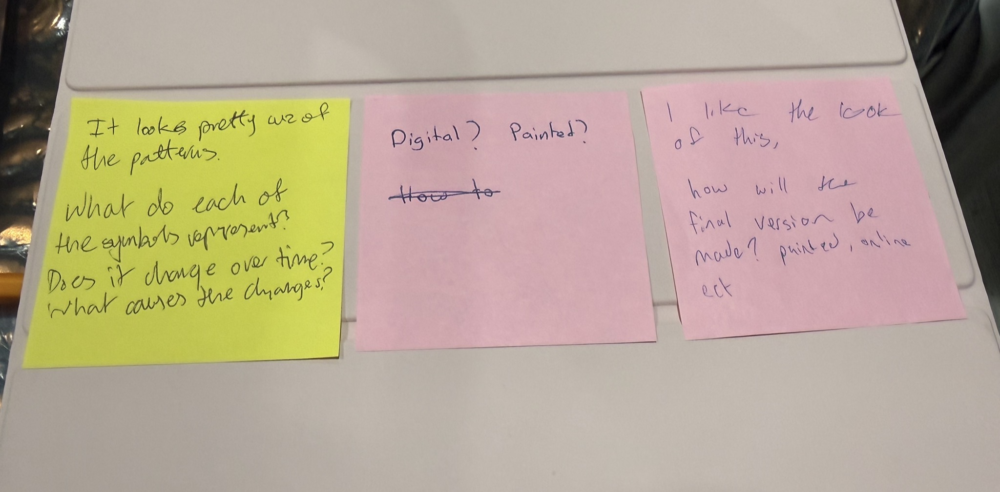
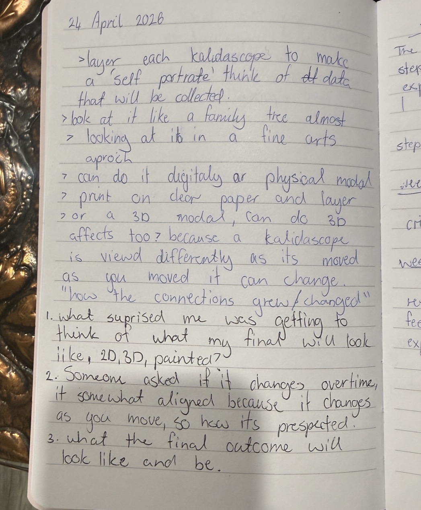

# Week 07

[← Back to Home](../index.md)

## Concept Development and Experimentation 
 ### 1. Concept sketches 
*This week I further developed my concept sketch and shared it with classmates to gather feedback. My sketch explored the idea of creating a self-portrait built from the perspectives and emotional impact of the people closest to me. The visual outcome was based on a kaleidoscope structure, with each segment representing a different relationship and contributing to the overall portrait.*
*The feedback I received was encouraging, as many people were drawn to the visual appearance and concept. A common question was how the final outcome would be made and whether it would be a physical piece, a digital experience, or a combination of both. This made me realise that while my concept was becoming clearer, I still needed to explore the format and interaction of the final artefact.*
*One idea that emerged from these discussions was the possibility of introducing movement. Rather than creating a static kaleidoscope, I began considering how the layers could rotate or shift over time, allowing viewers to see relationships connect, overlap, and evolve. This aligns with the idea that relationships are not fixed and continue to shape identity over time.*
*The feedback reinforced my interest in creating a layered and immersive experience while encouraging me to think more critically about materiality, interaction, and how the audience might engage with the work.*

###### feedback from my peers

##### brainstorming and thinking after reciving feedback

## 2. Making Sprint
*For the making sprint, I decided to investigate anamorphic imagery as a potential method for visualising my data. Since I was interested in creating a layered self-portrait that changes depending on perspective, I researched and sketched the basic principles behind anamorphic drawings.* 

*Through this experiment, I developed a better understanding of how distorted images can align when viewed from a specific angle. Although my sketch was simple, it helped me understand how layering and perspective could become an important part of the final piece.*

*This experiment made me excited about the possibility of using acrylic sheets or transparent layers to create an artwork that reveals different information depending on how it is viewed. Rather than presenting a single image, the piece could encourage viewers to move around it and discover new relationships and meanings from different perspectives.*
*While the experiment was exploratory, it helped me begin connecting my visual concept with a possible physical outcome and provided a new direction for further testing.*

## Images & Media

*Use the format below to embed images from your assets folder:*

``
`*Your caption here*`

*The text inside the square brackets is alt text (a description for accessibility), not a visible caption. To add a caption, place a line of italic text below the image.*

## AI Usage Statement

*Document any use of AI tools under an AI Usage Statement heading. Explain which tools you used and describe how you used them. Reference any AI-generated content (see [QuickCite](https://auckland.libguides.com/referencing-generative-ai-tools) for guidance).*
