# Week 07

[← Back to Home](../index.md)

## Concept Development and Experimentation 
 ### 1. Concept sketches
*This week I further developed my concept sketch and shared it with classmates to gather feedback. My sketch explored the idea of creating a self-portrait built from the perspectives and emotional impact of the people closest to me. The visual outcome was based on a kaleidoscope structure, with each segment representing a different relationship and contributing to the overall portrait.*
*The feedback I received was encouraging, as many people were drawn to the visual appearance and concept. A common question was how the final outcome would be made and whether it would be a physical piece, a digital experience, or a combination of both. This made me realise that while my concept was becoming clearer, I still needed to explore the format and interaction of the final artefact.*
*One idea that emerged from these discussions was the possibility of introducing movement. Rather than creating a static kaleidoscope, I began considering how the layers could rotate or shift over time, allowing viewers to see relationships connect, overlap, and evolve. This aligns with the idea that relationships are not fixed and continue to shape identity over time.*
*The feedback reinforced my interest in creating a layered and immersive experience while encouraging me to think more critically about materiality, interaction, and how the audience might engage with the work.*

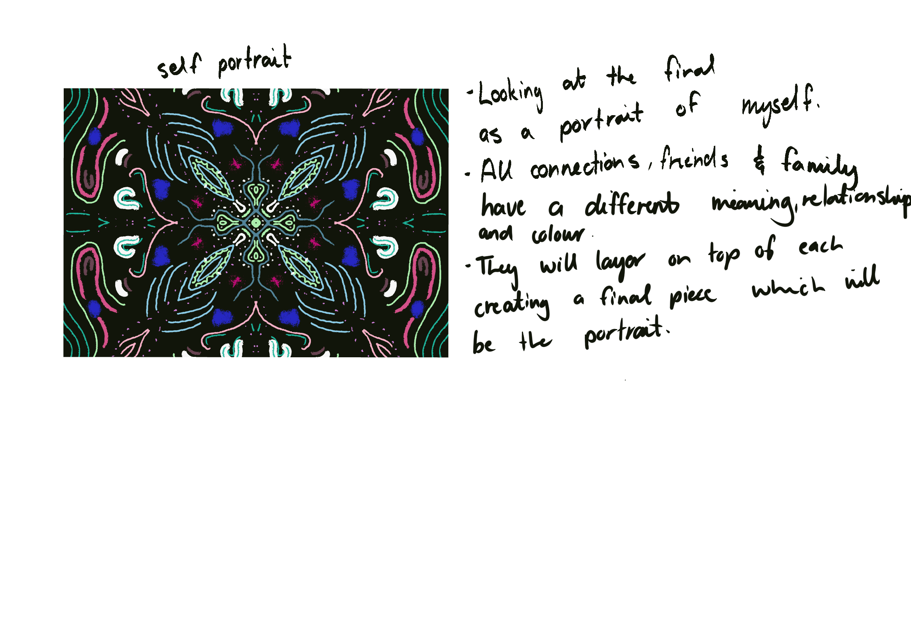
###### class showcase, what i got feedback from 

###### feedback from my peers

##### brainstorming and thinking after reciving feedback

## 2. Making Sprint
*For the making sprint, I decided to investigate anamorphic imagery as a potential method for visualising my data. Since I was interested in creating a layered self-portrait that changes depending on perspective, I researched and sketched the basic principles behind anamorphic drawings.* 

*Through this experiment, I developed a better understanding of how distorted images can align when viewed from a specific angle. Although my sketch was simple, it helped me understand how layering and perspective could become an important part of the final piece.*

*This experiment made me excited about the possibility of using acrylic sheets or transparent layers to create an artwork that reveals different information depending on how it is viewed. Rather than presenting a single image, the piece could encourage viewers to move around it and discover new relationships and meanings from different perspectives.*
*While the experiment was exploratory, it helped me begin connecting my visual concept with a possible physical outcome and provided a new direction for further testing.*
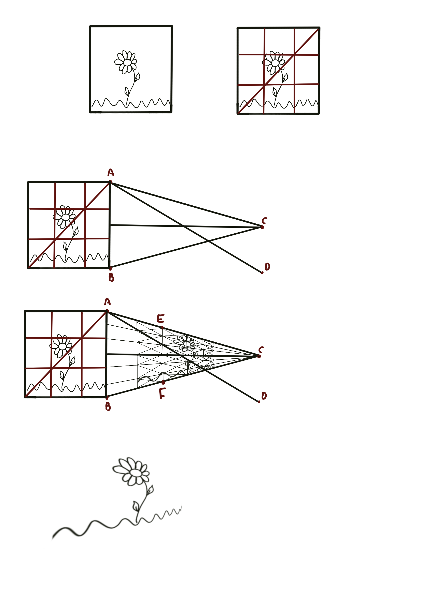
###### i watched a step by step on 2D anamorphics to understand the basics. 

## 3. "What If" Variations
*After discussing my project with Madi, she suggested an interesting variation that connected directly to my anamorphic experiment. Rather than using the layered structure purely for aesthetic purposes, she proposed that the depth of the layers could represent the growth of relationships over time.*
*This prompted me to consider several possibilities. The distance between layers could represent how long I have known someone, the frequency of our interactions, or the overall impact they have had on my life. These ideas introduce an additional dimension to the project, allowing the data to influence not only colour and pattern but also physical depth and spatial relationships.*
*I explored this variation through sketches and annotations, imagining how viewers might see relationships become stronger or more significant as they move around the work. This differs from my original approach, which focused primarily on creating a visual self-portrait through pattern and symmetry. The new direction introduces time, growth, and perspective as important themes and opens up opportunities to create a more immersive and meaningful final outcome.*
*Moving forward, I would like to continue experimenting with transparent materials, layered compositions, and anamorphic techniques to determine how these ideas could be integrated into the final artefact.*

## 1. Project Development & Skill Building
*This week I continued developing my self-portrait project by building on the ideas that emerged from my Making Sprint and "What If" variations. Following my exploration of anamorphic perspectives, I began thinking more deeply about how relationships could be represented not only through colour and pattern but also through depth, movement, and perspective.*
*A major focus this week was data collection. Since Week 6, I have been tracking my interactions with friends and family, recording the emotional impact these people have on me throughout my daily life. As the amount of data increased, I realised I needed a consistent system for translating experiences into visual elements. To address this, I assigned each person a specific colour that will remain consistent throughout the project. This allows individual relationships to be identified while still contributing to the overall self-portrait.*
*I also began developing a visual language of strokes and marks to represent different emotions and relationship qualities. Through experimentation, I explored how different line styles could communicate feelings such as comfort, tension, vulnerability, stability, and emotional intensity. This process helped me move beyond collecting data and begin translating it into a visual form.*
*Alongside developing the visual language, I researched potential materials and construction methods for the final outcome. I explored wire, mirrored acrylic, and 3D printing as possible approaches. Each offered different opportunities for creating depth and perspective, but I am currently most interested in combining wire and mirrored acrylic because they support both the emotional qualities of the work and the reflective nature of the kaleidoscope concept.*
*This week's development has helped transform my project from an initial idea into a more structured system. I now have a clearer understanding of how data collection, colour, mark-making, material experimentation, and anamorphic perspectives can work together to create a self-portrait shaped by the people around me.*

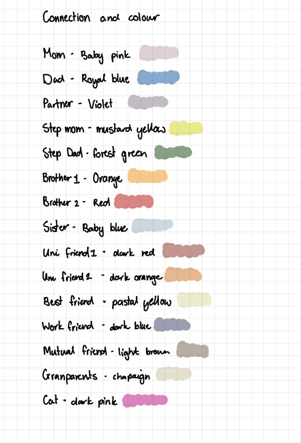
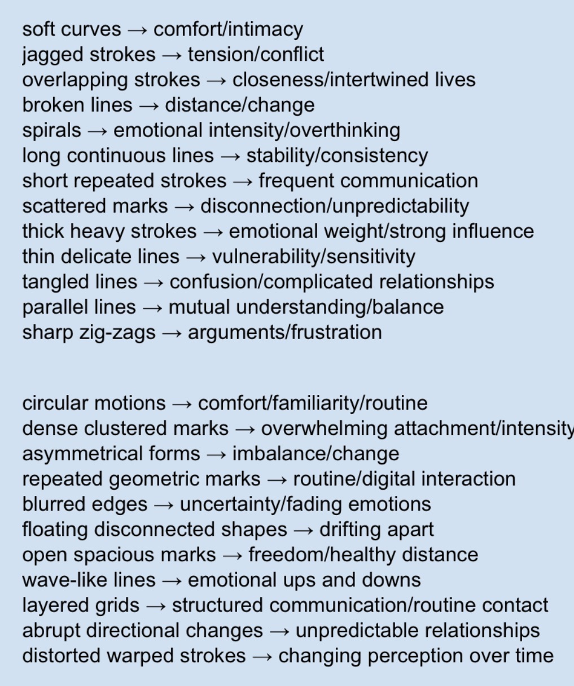

## 2. Progress Report
*To prepare for my Week 8 progress report, I created a five-slide presentation that documented my project's current direction, key developments, visual references, and areas where I wanted feedback. Organising my research and experiments into a presentation helped me identify how much the project had evolved since my initial proposal.*
*I'm outlining my core concept of creating a self-portrait through relationships, using a kaleidoscope structure as a metaphor for identity. It also documents my developing data collection process, colour-coding system, emotion-based mark-making language, and investigations into anamorphic sculpture and layered materials.*
*Preparing the slides helped me clarify several important decisions. I recognised that the project is becoming less about creating a static image and more about creating an experience that changes through movement and perspective. I also became more confident in exploring depth and layering as ways to represent the significance of different relationships.*

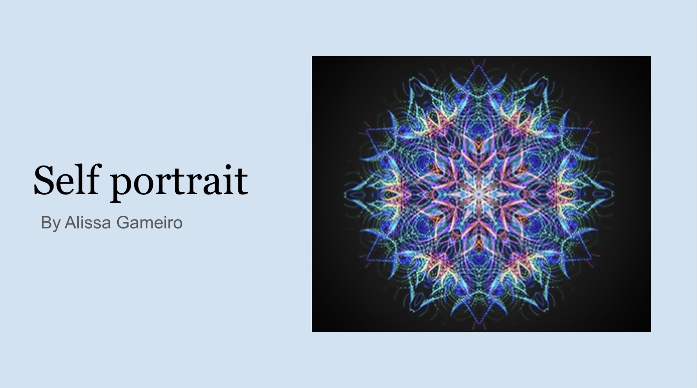
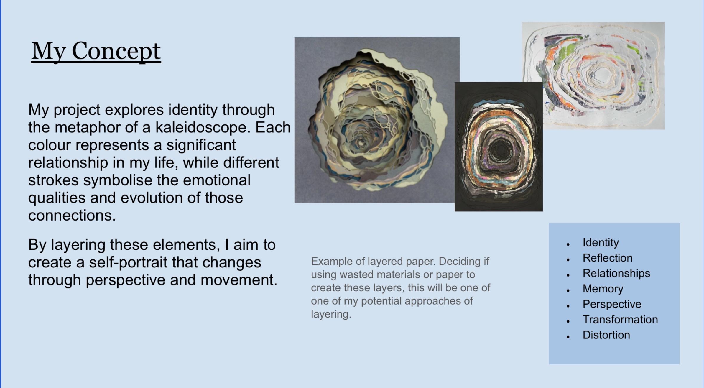
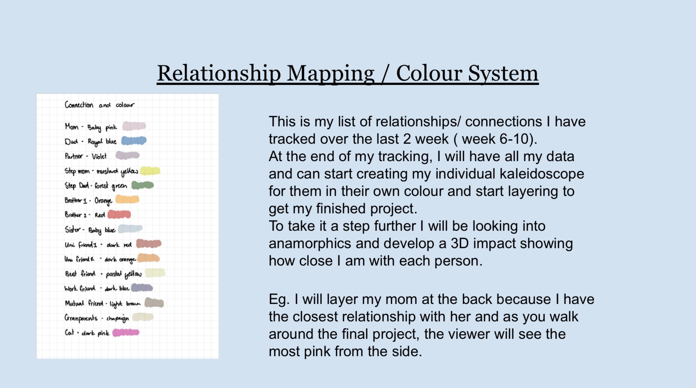
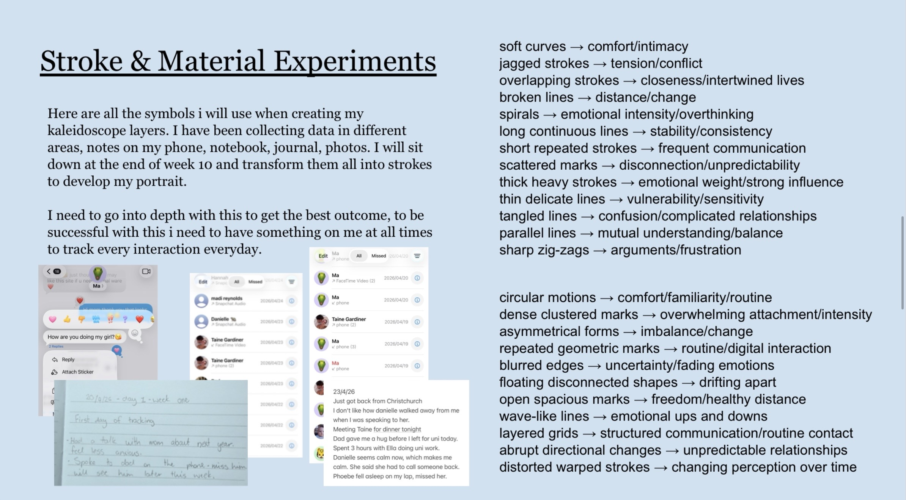
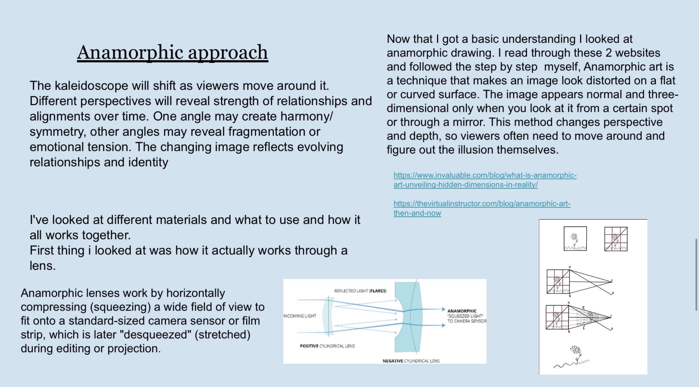
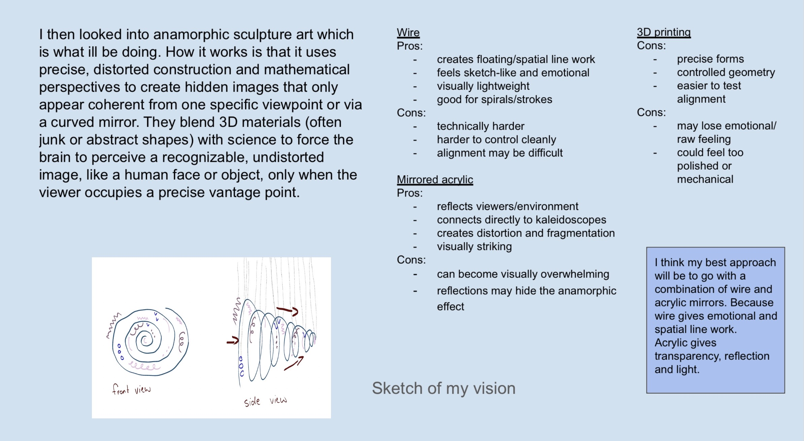
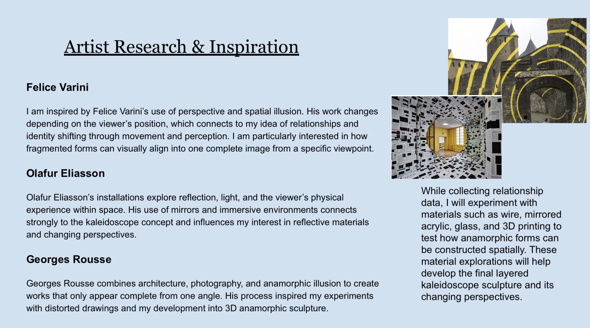
###### here are the slides ive provided for next weeks crits. 