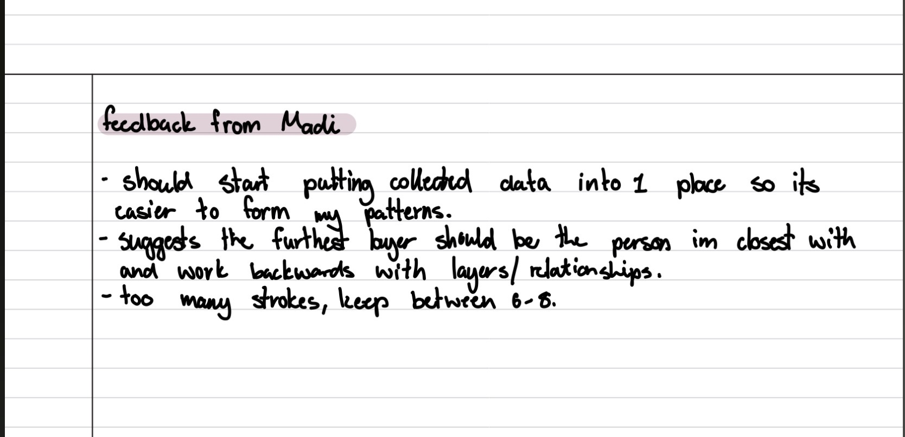
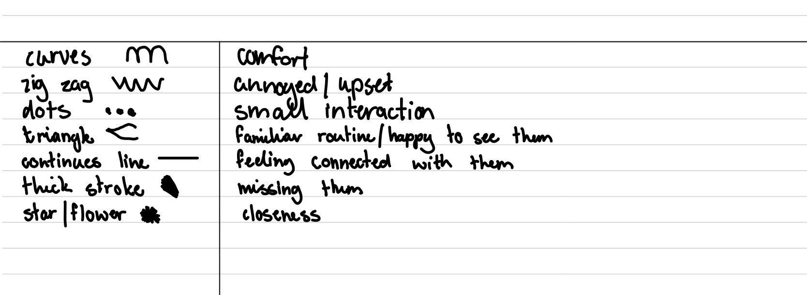
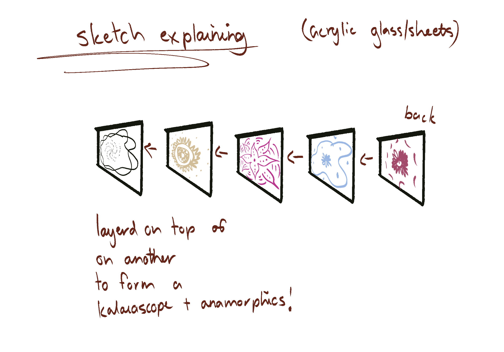

# Week 08

[← Back to Home](../index.md)

## Progress Reports  

*Due to attending a family funeral and travelling during class time, I was unable to participate in the scheduled progress report session. Instead, I shared my presentation and project development with Madi and received informal feedback on my concept, visual system, and potential final outcome.*
*One of the most valuable suggestions was to reconsider the layering system within the final piece. Madi proposed placing the most meaningful relationship on the bottom layer so that it remains visible throughout the entire artwork. This would allow the most influential person to become a foundation for the portrait, reflecting how certain relationships have had a lasting impact on my identity.*
*We also discussed the physical presentation of the work. While I had been exploring a range of possibilities, including wire structures, 3D printing, and layered sculptures, the conversation reinforced my interest in using acrylic sheets. Acrylic would allow me to create transparent layers, support the anamorphic viewing experience, and maintain the kaleidoscope-inspired visual qualities that have become central to the project.*
*Another point of feedback was the complexity of my emotional mark-making system. Initially, I had developed a large number of stroke types to represent different emotions and relationship qualities. Madi suggested simplifying this system to approximately six to eight core emotional categories. This would make the visual language easier to understand while still retaining emotional depth.*

## 2. Critical Design Proposition

### What aspect of their approach is most interesting?
*I was really interested how madi will add the beads onto the yarn and how all the poles will be around the center one.*

### What is least developed?
 *Maybe the connection part, i didnt get a good insight of it more of how the final will look. I think it will only be long distanced friendships and could potentially not be enough data just based off phone calls and texts.*

### Is there an alternative form (e.g. physical, screen-based, interactive) that could strengthen the work? 
*Could potentially hang it up on a wall? So you can see it from the top and see all the strings from a birds eye view.*

### How might their future scenario or intended impact be communicated more powerfully? 
*Maybe the scales of the poles eg- a thicker pole indicates she is really close with that person, a thinner pole, not that close.*

### What else would you change or do differently if this were your project?
 *I would add other materials to the beads just so its not too confusing and add more texture, since the yarn will be different colours i would add different materials to hang off the yarn in neutral colours.* 

## 1. Reflective Summary
*The most significant feedback I received this week focused on simplifying and strengthening the systems that underpin my project. While my concept of creating a self-portrait through relationships was well received, the discussions highlighted opportunities to make the visual language and physical structure more intentional.*

*One of the key ideas was using the layering system to communicate relationship significance. Rather than positioning layers randomly, the depth of each layer could represent the importance or influence of a particular person within my life. The suggestion to place the most meaningful relationship on the bottom layer was particularly impactful because it transforms the physical structure into a form of storytelling. This person would become visible throughout the portrait, reinforcing the idea that certain relationships form the foundation of who we are.*

*Another important point concerned the emotional mark-making system. I realised that having too many emotional categories may make the final work difficult to read and potentially weaken the visual impact. As a result, I have decided to reduce the number of emotional markers to a smaller set of core emotions that can be applied more consistently across the dataset.*

*Finally, the feedback reinforced my interest in using acrylic as the primary material. Its transparency, reflective qualities, and ability to support layering align strongly with both the kaleidoscope concept and the anamorphic viewing experience.*

*Moving forward, I will focus on refining the emotional tracking system, testing layered acrylic prototypes, and establishing a clear hierarchy for how relationship significance is represented within the final portrait.*

## 2. Project Development
*Following the feedback I received, I focused on simplifying and strengthening the visual systems within my project. One of the main changes I made was refining my emotional tracking system. Initially, I had developed a large number of stroke types to represent different emotions and relationship qualities. After reflecting on the feedback, I realised that the system had become overly complex and could make the final artwork difficult to read. To address this, I reduced the number of emotional categories to a smaller set of core emotions that can be applied more consistently across the project.*

*I also began developing a clearer hierarchy for the layering system. Rather than positioning each relationship randomly, I explored how the depth of each layer could communicate significance. Inspired by feedback from Madi, I tested the idea of placing the most meaningful relationship on the bottom layer so that it remains visible throughout the entire piece. This approach strengthens the conceptual link between identity and the people who have had the greatest influence on my life.* 

*Alongside these developments, I continued researching acrylic as a potential material for the final outcome. I explored how transparent acrylic sheets could support layering, colour, reflection, and the anamorphic viewing experience. Through sketching and planning, I began considering how the individual relationship layers could be separated physically while still combining to form a unified portrait.*

*These developments have helped move my project from a broad concept towards a more resolved visual and structural system. I now have a clearer understanding of how the data, emotional language, layering strategy, and material choices will work together to communicate the influence of relationships on identity.*

###### these are my final 7 strokes ive decided to continue with for the next two weeks. 

###### a rough sketch of the acrylic glass/ shetts for my final. iver decided to go down this route because i will be able to see each layer through the other and if i move around it, it will be visable to see the 3D anamorphics im trying to successed in. 