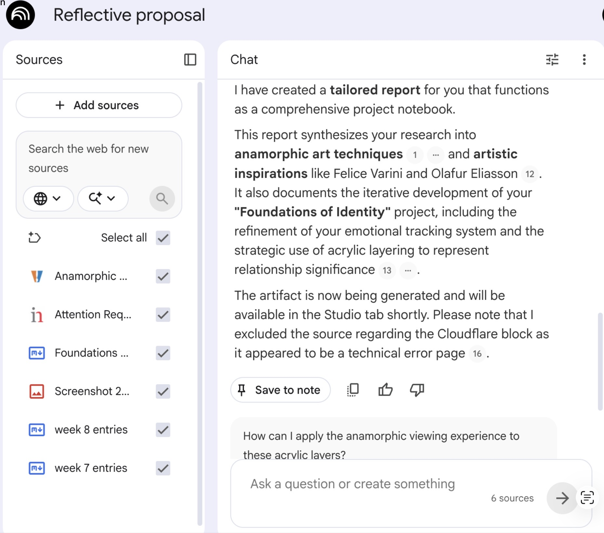
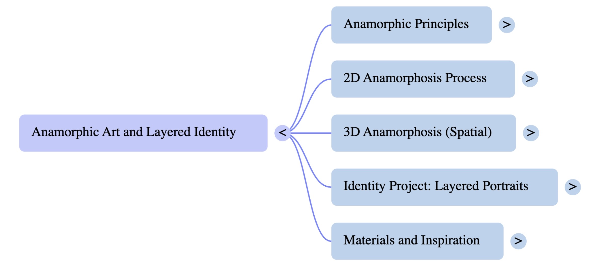
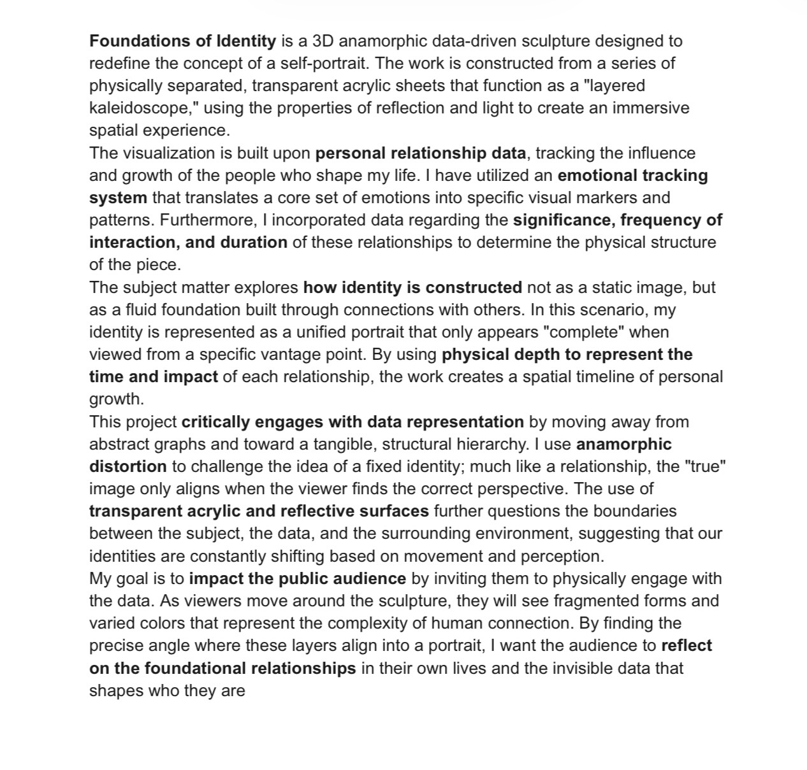
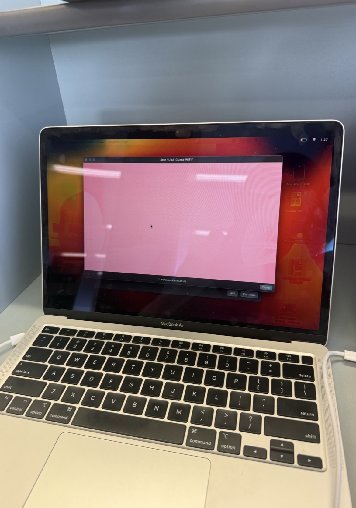

# Week 09

[← Back to Home](../index.md)

*This week unfortunately i was sick, i couldnt take part in adding to the miro in pairs. Answering the question provided, I wrote my first draft:*
* What are the data sources used in this work?
* What is the future scenario it addresses?
* What does the statement argue about data and power?
* What might be the intended impact, and is this included in the statement?

## Project Statement – First Draft
#### (Wrote a statement insted of sticky notes.)
*This project explores how relationships shape personal identity through a data-driven self-portrait. Over four weeks, I collected data about my daily interactions with friends and family, documenting the emotions, behaviours, and experiences connected to each relationship. Rather than creating a portrait based solely on self-reflection, I wanted to investigate how the people around me contribute to who I am.*
*The project uses a kaleidoscope as a metaphor for identity. Each person is represented by a unique colour, while different marks and strokes represent emotional experiences and relationship qualities. These visual elements are layered together to create a portrait formed through connection rather than individuality.*
*The final outcome is intended to be a layered acrylic sculpture that incorporates anamorphic perspectives. As viewers move around the work, different relationships become visible, overlap, and shift in importance. This changing perspective reflects how relationships evolve over time and how identity is shaped by multiple influences rather than a single fixed view.*
*The project questions whether personal relationships can ever truly be represented through data and explores the tension between measurable information and lived emotional experience.* 

## Note book LM
*I created a notebook following the steps in class activities and class slides for week 9. I uploaded:* 
* my report summary 
* week 7 & 8 entries
* artists I looked into for anamorphics 
* resources i used to read and understand anamorphics
 
 
 ###### made a mind map of all my resources for fun and just testing the app 

 
###### my first draft using the templete from class slides. 

## Evaluation
### What is working well?
*The statement clearly explains the relationship between data collection, identity, and the final visual outcome. It also establishes a strong connection between the kaleidoscope metaphor and the concept of multiple perspectives.*

### What is missing or underdeveloped?
*The statement could further explain why anamorphic perspectives are important and how the layering system represents relationship significance.*

### What feels overly generalised?
*The discussion around emotions and identity could be more specific to my own data collection process and experiences.*

### What do I need to research further?
*I need to continue researching anamorphic sculpture, acrylic fabrication techniques, and artists who use perspective and layered spatial installations.*

### Commitment Statement
*I will create a layered self-portrait that uses colour, mark-making, and anamorphic perspectives to visualise how relationships shape identity over time.* 

## Making Sprint
*As I was unable to attend class due to illness, I completed an independent making sprint focused on refining the visual systems within my project. Following feedback from previous critiques, I reduced the number of emotional categories used within my mark-making system to create a clearer and more consistent visual language.*
*I also began exploring how relationship importance could influence the layering structure of the final work. Rather than positioning relationships equally, I investigated the possibility of placing the most influential relationships on deeper layers so that they remain visible throughout the portrait.*
*Alongside this development, I continued researching acrylic as a potential material and sketched possible construction methods for a layered anamorphic sculpture. This process helped me better understand how colour, depth, and transparency could work together to communicate identity and connection.*
*The sprint helped transform several conceptual ideas into practical decisions that can now be tested through prototyping.*

## Round Robin Rapid Reactions
*Due to illness, I was unable to participate in the Round Robin discussion. To continue developing the project, I reflected on the feedback received during previous critiques and considered the questions that viewers may still have about the work.*
*The strongest aspect of the project is the relationship between identity and perspective. The use of colour, layering, and anamorphic viewing creates a visual representation of how relationships influence personal identity.*
*The main area that still requires development is the physical construction of the final piece. While I have explored several material options, I need to continue testing how the acrylic layers will be assembled and how viewers will interact with the work.*
*Moving forward, I want to ensure that the relationship between the collected data and the final visual outcome remains clear. I also need to continue refining how relationship significance is represented through layering and depth.*

## 1. Project Development
*This week I continued developing my self-portrait project by refining the systems that connect my collected data to the final visual outcome. Building on previous feedback, I focused on simplifying my emotional tracking system and strengthening the relationship between the data and the physical structure of the artwork.*
*One of the most significant developments was reducing the number of emotional categories used within my mark-making system. Initially, I had created a large range of emotional indicators, but I realised that too many categories would make the final piece difficult to interpret. I therefore refined the system to a smaller set of core emotions, allowing the marks and patterns to communicate more clearly while still capturing the complexity of my experiences.*
*I also continued collecting and organising data from my interactions with friends and family. As the dataset grew, I began thinking more critically about how different relationships should be represented within the final work. Rather than treating every relationship equally, I explored the idea that the most influential people should occupy the deeper layers of the portrait, creating a visual hierarchy that reflects their importance in shaping my identity.*
*Alongside this conceptual development, I continued investigating acrylic as the primary material for the final outcome. Through sketching and planning, I explored how transparent layers could be stacked to create depth, reflection, and anamorphic viewing effects. These experiments helped me better understand how viewers might experience the work from different angles and how relationships could remain visible across multiple layers.*
*This development has moved the project forward by creating stronger connections between the data, the visual language, and the final physical form. The project is becoming less about creating a decorative kaleidoscope and more about communicating how relationships influence identity through colour, layering, and perspective.*

## 2. Progress Report
*Unfortunately, I was unable to complete my planned progress report slideshow this week due to technical issues after my laptop stopped working. As a result, I focused on preparing discussion points and feedback questions instead, ensuring that I could still receive meaningful critique and continue developing the project.*
*Rather than presenting a completed slideshow, I reviewed my project development so far and identified the areas where I needed the most guidance. This process helped me clarify several important decisions regarding the visual language, layering system, and final presentation format.*
*To support future development, I prepared a series of questions that I would like feedback on from peers and tutors. These questions focus on both the conceptual and practical aspects of the project and will help guide the next stage of experimentation and making.*

*#worst week of my life, set me back in all my classes.*

### My questions I want answered out of next weeks crits in different catagories: 
## Conceptual
* Does the idea of a self-portrait built from relationships come across clearly?
* Do the layered acrylic sheets effectively communicate how relationships shape identity?
* Does the anamorphic perspective add meaning to the project, or does it feel separate from the concept?

## Visual
* Is the colour system easy to understand, or does it need additional explanation?
* Does reducing the emotional categories make the visual language clearer?
* How abstract should the final portrait be before it becomes difficult to interpret?
## Making / Showcase
* Should the final piece be wall-mounted, hanging, or freestanding?
* How much movement should be incorporated into the final outcome?
* What should determine the depth of each layer: emotional impact, relationship duration, or interaction frequency?
* If one layer was removed from the portrait, should viewers immediately notice the loss? Why or why not?
