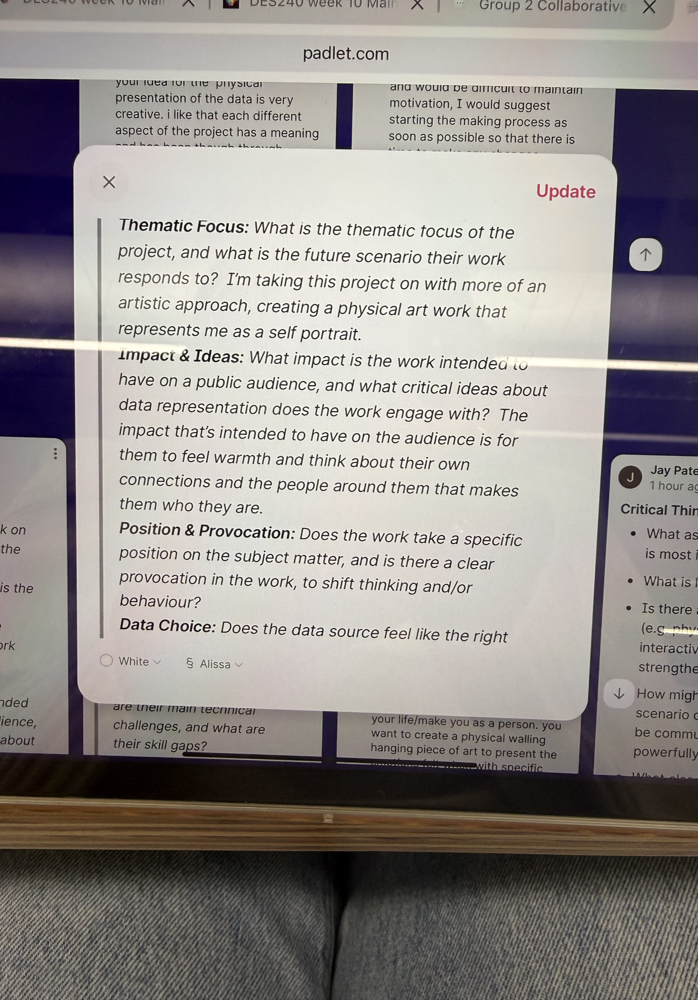
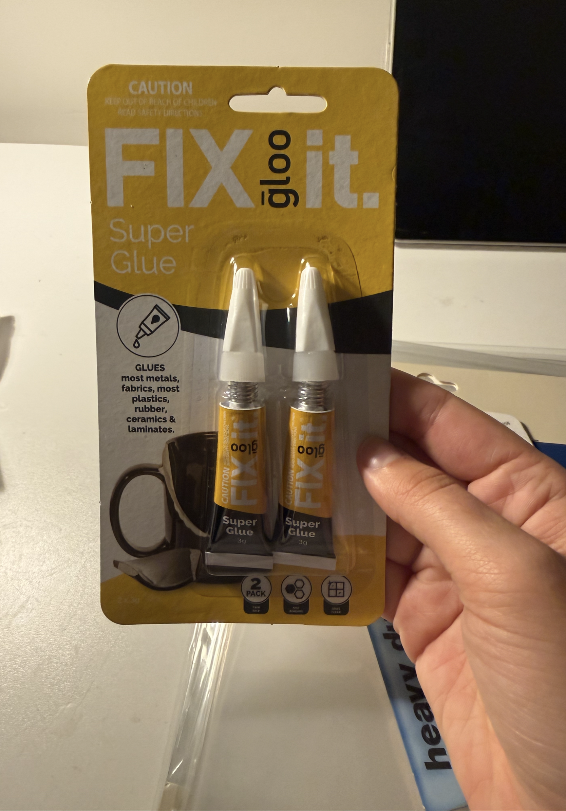
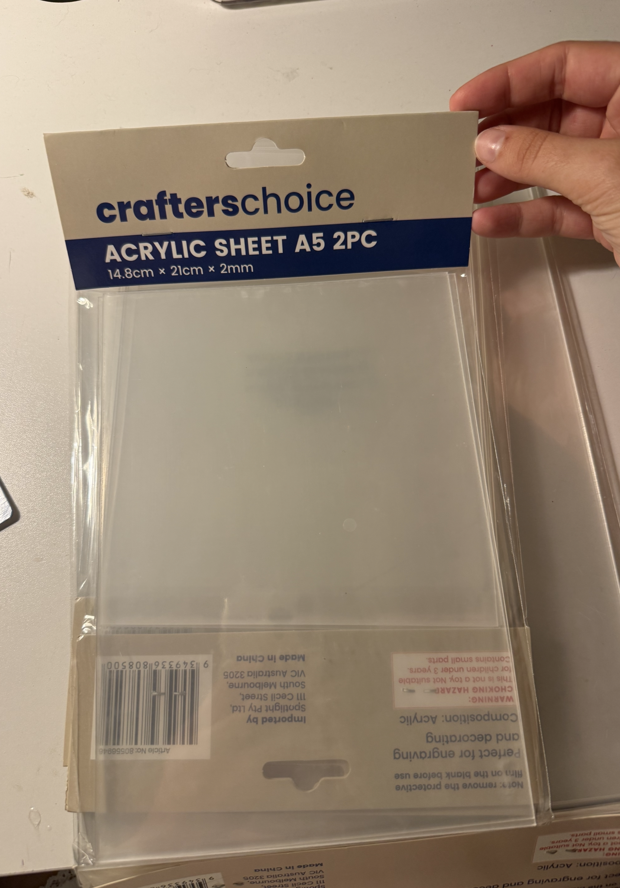
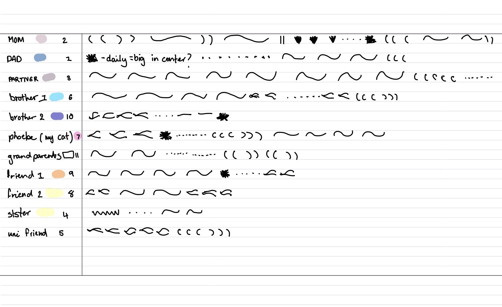

# Week 10

[← Back to Home](../index.md)

## Peer Feedback
##### feedback from Madi. 
### Does the idea of a self-portrait built from relationships come across clearly?
*Yes, I think this is one of the strongest parts of your project. I understand that the portrait is not just about you, but about how the people around you have shaped your identity. I think this personal connection makes the project memorable.*

### Do the layered acrylic sheets effectively communicate how relationships shape identity?
*I think the layering idea works really well because it physically shows how different people build up your identity over time. The idea of having the most important person on the bottom layer makes a lot of sense and strengthens the concept.*

### Does the anamorphic perspective add meaning to the project, or does it feel separate from the concept?
*I think it definitely adds meaning. The fact that the work changes depending on where you stand reflects how people see different sides of you and how relationships can change over time. It feels connected to the overall idea.*

## Visual
### Is the colour system easy to understand, or does it need additional explanation?
*The colour system makes sense, but I think viewers may need a simple key or explanation so they know that each colour represents a different person.*

### Does reducing the emotional categories make the visual language clearer?
*Yes. I think having fewer emotional categories will make the final work stronger and easier to read. Too many different marks might become confusing.*

### How abstract should the final portrait be before it becomes difficult to interpret?
*I think it should stay fairly abstract because that suits the project, but there should still be enough information for viewers to understand the relationship between the data and the final outcome. Small explanations or labels could help.*

## Making / Showcase
### Should the final piece be wall-mounted, hanging, or freestanding?
*I think a hanging installation or freestanding sculpture would be the most effective because people could move around it and experience the anamorphic effect from different angles.*

### How much movement should be incorporated into the final outcome?
*I don't think it needs mechanical movement. I think the viewer moving around the work is enough and fits the concept better. The changing perspective becomes part of the experience.*

### What should determine the depth of each layer: emotional impact, relationship duration, or interaction frequency?
*I think emotional impact is the strongest option because it feels the most personal and meaningful. It also connects directly to the idea that some people have shaped your identity more than others.*
### If one layer was removed from the portrait, should viewers immediately notice the loss? Why or why not?
*Yes, I think they should. If a person has had a significant impact on your life, removing them should change the portrait. This would reinforce the idea that identity is built through relationships and that every important connection contributes to who you are.*

## Padlet board & Gallery Walk

## Action Plan
*The feedback I received helped me identify several areas that could strengthen my project both conceptually and visually. The most significant point was that the idea of a self-portrait built through relationships comes across clearly and is one of the strongest aspects of the work. This gave me confidence that the project has a clear direction and that the personal connection is meaningful to viewers.*
*A key suggestion was to continue developing the layering system so that it communicates relationship importance rather than acting as a purely visual effect. The idea that the most meaningful relationships should remain visible throughout the entire portrait reinforced my interest in using depth to represent emotional impact. I now want to establish a clear hierarchy for the layers and ensure that each placement has a purpose.*
*Another important piece of feedback was simplifying the visual language. Reducing the number of emotional categories will make the final outcome easier to understand and create a stronger connection between the collected data and the visual result. I also realised that the colour system may require a simple key or explanation to help viewers understand that each colour represents a different person.*

*The discussion around the final presentation was also valuable. Feedback suggested that a hanging or freestanding acrylic installation would allow viewers to move around the work and experience the anamorphic effect more naturally. Rather than adding mechanical movement, I will focus on the movement of the audience as part of the experience.*
*Moving forward, my action points are to refine the emotional mark-making system, finalise the layering hierarchy, continue testing acrylic materials, and develop a clearer visual explanation of how the data is translated into the final self-portrait.*

## Independent Study – Project Development
*This week I focused on moving my project from the planning and research stages into the early stages of production. Following the feedback from the critique session, I concentrated on refining the visual systems that will form the final self-portrait and began thinking more seriously about how the work will physically exist.*

*A major milestone was completing the data collection process. Over several weeks, I tracked my interactions and emotional responses to the people closest to me, recording how these relationships influenced my daily life. Once the collection was complete, I organised and translated the data onto my iPad, creating a visual plan for the final artwork. Seeing all of the information together helped me understand the balance between the different relationships and how they contribute to the overall portrait.* 
*I also continued refining the emotional mark-making system and colour coding developed in earlier weeks. Simplifying these systems has made the project easier to understand and will create a stronger connection between the collected data and the final visual outcome.*

*With only two weeks remaining before the showcase, I have started focusing on materials and construction. My current direction is to create separate transparent layers that can be joined together using glass adhesive. Each layer will represent an individual relationship, and by stacking them together, the work will create an anamorphic effect when viewed from the side. This approach supports the idea that identity is built from multiple overlapping relationships and allows the audience to physically experience different perspectives as they move around the work.*
*Through this development, I have learnt that the material choices are just as important as the data itself. The transparency, layering, and depth of the final object will become part of the narrative, helping communicate how relationships continue to shape identity over time. This week has moved the project significantly closer to a resolved outcome and has established a clear direction for the final making process.*

###### Materials I've gotten so far!! 

###### This is my final list of people, colours and data transformed into the strokes. I've made notes on strokes that keep reacuring so I can transform it into a larger shape instead of random strokes everywhere. Eg. repetitive straight line = circle. 
