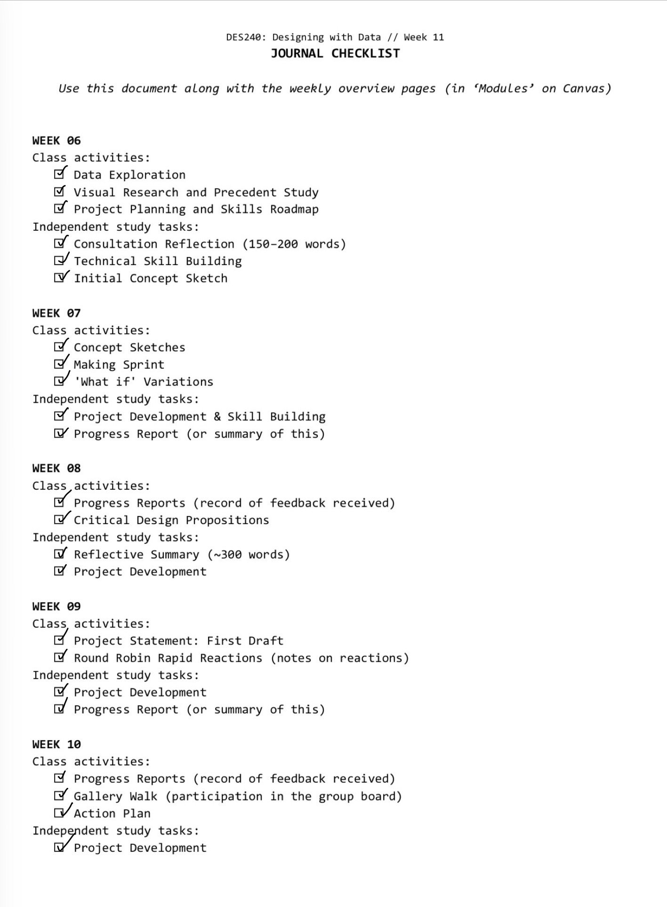
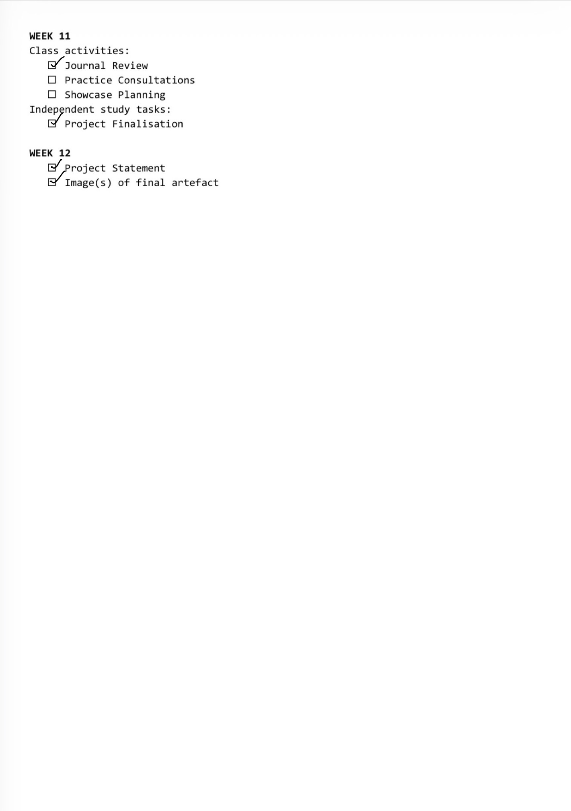
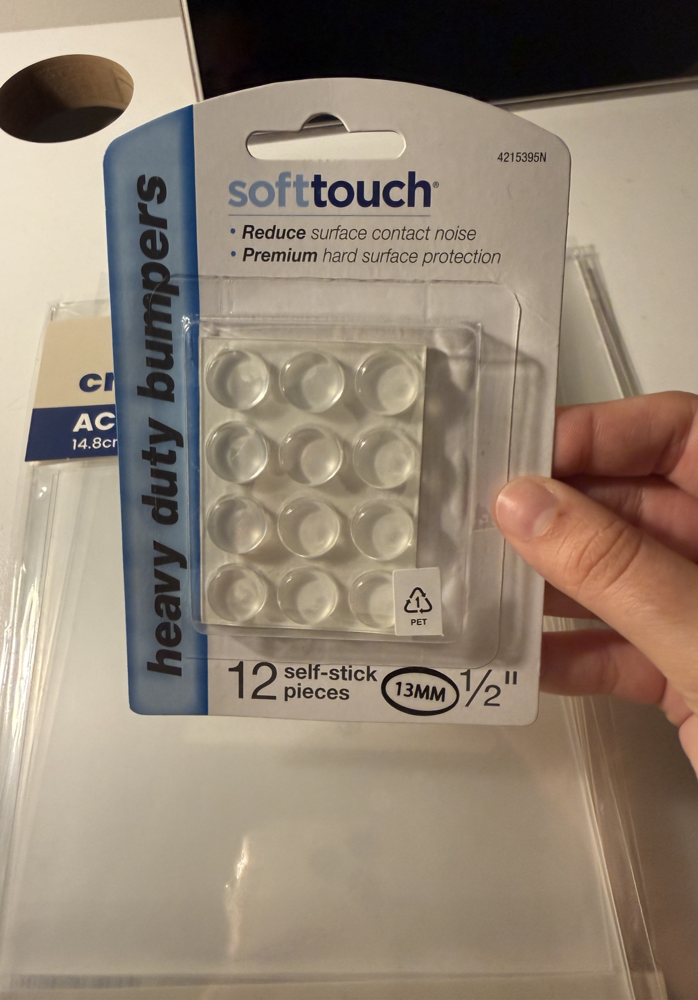
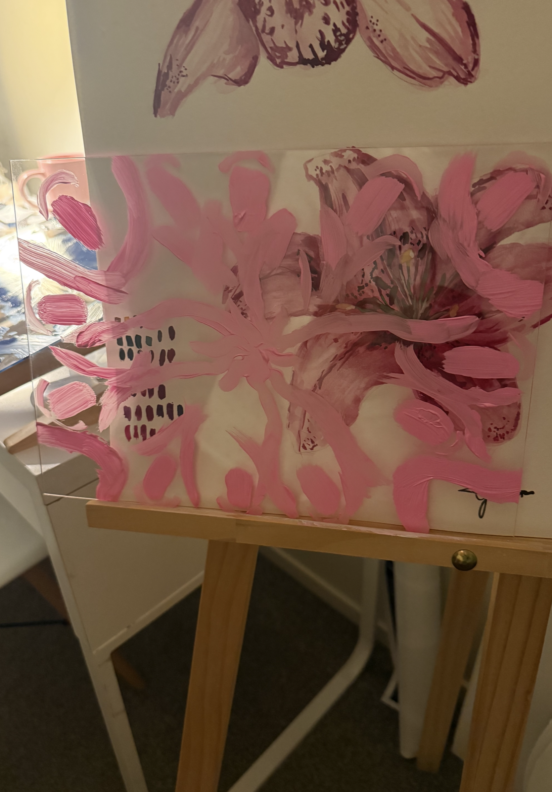
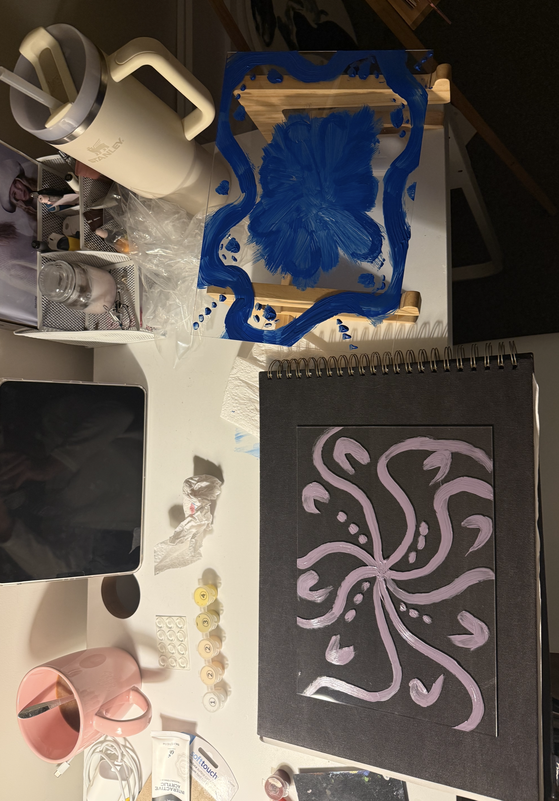
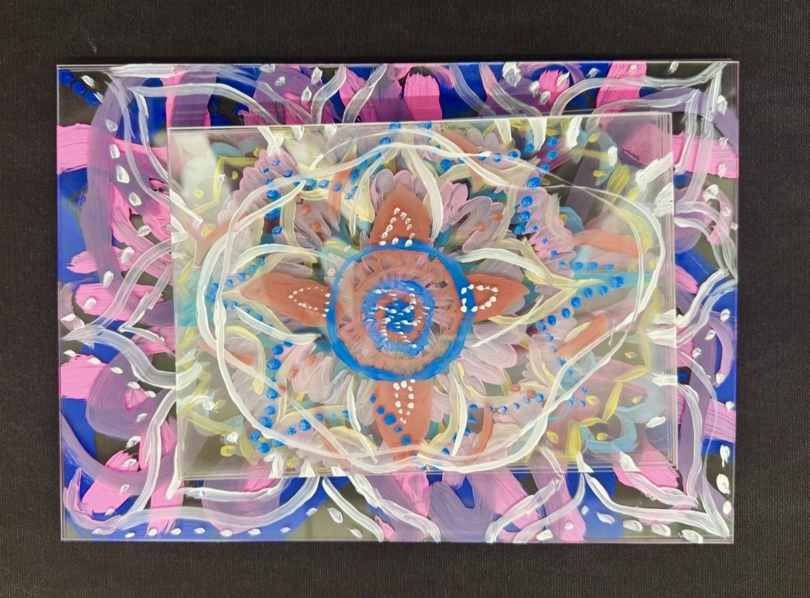

# Week 11

[← Back to Home](../index.md)

## 1. Journal Review
*Although I was unable to attend class this week, I completed the journal checklist independently to review my work from Weeks 6–10. Looking back over my journal helped me see how the project has developed from an initial idea into a physical artefact. I found that my journal has a good balance of research, experimentation, reflection, and visual documentation, and it clearly records the evolution of my decision-making process.*

### Key Moment 1 – Redefining the project
*One of the biggest turning points was changing my project from a general exploration of friendships to a self-portrait built from the emotional impact of friends and family. This shift made the project more personal and gave the data collection process a stronger purpose.*

### Key Moment 2 – Discovering anamorphic layering
*Researching anamorphic art and experimenting with layered perspectives changed the direction of the project significantly. Rather than creating a flat visualisation, I began developing a physical object that changes depending on the viewer's position, reinforcing the idea that identity is shaped through multiple perspectives.*

### Key Moment 3 – Moving into physical making
*Completing the data collection and beginning the construction process was another major milestone. Translating the collected data into painted layers and experimenting with transparent spacers helped me understand how the material itself can communicate meaning. The physical depth of the work has become just as important as the data it represents.*
*Reviewing the journal also helped me identify areas to improve before submission. I want to continue refining the documentation of my making process and ensure that the connection between the collected data and the final artwork remains clear throughout the journal.*

## Independent Study – Project Finalisation
*This week I focused on constructing the physical artwork and testing how the individual relationship layers would work together. Following previous experiments with layering and transparency, I introduced small clear spacers between each painted layer to create physical separation and increase the depth of the final piece. This development strengthened the anamorphic effect and made the individual relationships more visible when viewing the work from the side.*
*One of the biggest challenges during this process was the construction itself. Each painted layer had to dry completely before I could continue working on the next one. This required patience and careful planning, as any mistakes or misalignment would affect the overall portrait. It was also important to ensure that the layers aligned correctly when assembled so that the final image remained coherent while still creating the desired depth and perspective.*

*Through this making process, I learnt that the physical construction is just as important as the collected data. The spacing between layers, the transparency of the materials, and the alignment of the painted forms all contribute to communicating how relationships shape identity over time.*
*This stage of the project has moved my work significantly closer to the final outcome. With the data collection complete and the layering system established, my focus is now on refining the construction and preparing the work for the Week 12 showcase.*

###### I got these clear stickies to elevate layers to show the anamorphics clearer.

###### some progress shots.

###### Final!!! I got different size acrylic sheets to create more dimention, ready for week 12. 
